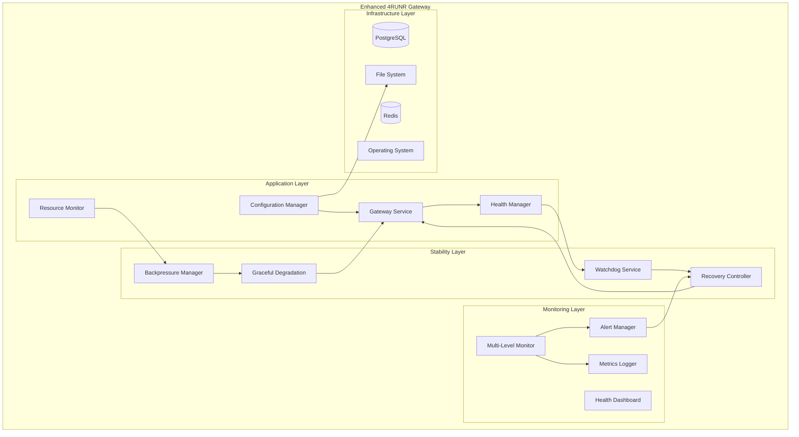
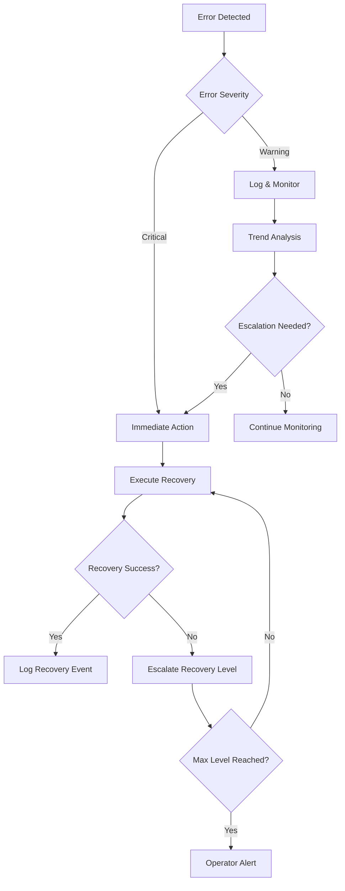

# Long-Term Stability Design Document

## Overview

This design document outlines the technical architecture and implementation strategy for improving the 4RUNR Gateway's long-term stability and reliability. The solution addresses critical issues identified during the failed 48-hour burn-in test, including service unresponsiveness, configuration corruption, monitoring gaps, and platform-specific reliability issues.

The design focuses on implementing robust health management, configuration safety, enhanced monitoring, graceful degradation, and platform-agnostic reliability mechanisms to achieve enterprise-grade stability for extended operations.

## Architecture

### Current System Analysis

**Strengths:**
- Excellent short-term performance (300 RPS, sub-10ms latency)
- Comprehensive security policy enforcement
- Effective circuit breakers and retry mechanisms
- Good observability with Prometheus metrics

**Critical Issues Identified:**
- Service becomes unresponsive after ~5 hours of operation
- Configuration corruption during chaos injection
- Monitoring gaps when application fails
- Platform-specific command execution issues (Windows/WSL2)
- Lack of automatic recovery mechanisms

### Enhanced Architecture Components



## Components and Interfaces

### 1. Health Manager Service

**Purpose:** Centralized health monitoring and lifecycle management

**Interface:**
```typescript
interface HealthManager {
  // Health monitoring
  checkApplicationHealth(): Promise<HealthStatus>
  checkDependencyHealth(): Promise<DependencyStatus>
  registerHealthCheck(name: string, check: HealthCheck): void
  
  // Lifecycle management
  gracefulShutdown(timeoutMs: number): Promise<void>
  forceRestart(reason: string): Promise<void>
  
  // Resource monitoring
  getResourceUsage(): ResourceMetrics
  detectResourceLeaks(): LeakDetection[]
}

interface HealthStatus {
  status: 'healthy' | 'degraded' | 'unhealthy'
  checks: Record<string, CheckResult>
  uptime: number
  lastHealthy: Date
}
```

**Implementation Strategy:**
- Independent health check process (separate from main application)
- Configurable health check intervals and thresholds
- Automatic escalation from warnings to critical alerts
- Integration with existing Prometheus metrics

### 2. Configuration Manager

**Purpose:** Safe, atomic configuration management with rollback capabilities

**Interface:**
```typescript
interface ConfigurationManager {
  // Safe configuration updates
  updateConfig(changes: ConfigChanges): Promise<ConfigResult>
  rollbackConfig(version?: string): Promise<void>
  validateConfig(config: Configuration): ValidationResult
  
  // Atomic operations
  withConfigLock<T>(operation: () => Promise<T>): Promise<T>
  backupConfig(): Promise<string>
  restoreConfig(backupId: string): Promise<void>
}

interface ConfigChanges {
  environmentVars?: Record<string, string>
  featureFlags?: Record<string, boolean>
  chaosConfig?: ChaosConfiguration
}
```

**Implementation Strategy:**
- File-based configuration with atomic writes
- Configuration versioning and backup system
- Validation before applying changes
- Rollback mechanism for failed updates
- Cross-platform file handling (Windows/Linux compatibility)

### 3. Watchdog Service

**Purpose:** External process monitoring and automatic recovery

**Interface:**
```typescript
interface WatchdogService {
  // Process monitoring
  monitorProcess(pid: number, config: MonitorConfig): void
  checkProcessHealth(): Promise<ProcessHealth>
  
  // Recovery actions
  restartProcess(reason: string): Promise<void>
  killAndRestart(signal?: string): Promise<void>
  
  // Escalation
  escalateToOperator(issue: CriticalIssue): void
  recordRecoveryEvent(event: RecoveryEvent): void
}

interface MonitorConfig {
  healthCheckUrl: string
  maxResponseTime: number
  maxMemoryMB: number
  maxCpuPercent: number
  checkInterval: number
}
```

**Implementation Strategy:**
- Separate Node.js process or system service
- Platform-agnostic process management
- Configurable recovery strategies
- Integration with container orchestration health checks

### 4. Multi-Level Monitoring System

**Purpose:** Comprehensive monitoring that works even when application fails

**Architecture:**
```typescript
interface MultiLevelMonitor {
  // Application-level monitoring
  collectAppMetrics(): Promise<AppMetrics>
  
  // System-level monitoring
  collectSystemMetrics(): Promise<SystemMetrics>
  
  // Infrastructure monitoring
  collectInfraMetrics(): Promise<InfraMetrics>
  
  // Persistent storage
  persistMetrics(metrics: AllMetrics): Promise<void>
  queryMetrics(query: MetricsQuery): Promise<MetricsResult>
}
```

**Monitoring Levels:**
1. **Application Level:** Response times, throughput, errors
2. **Process Level:** Memory, CPU, file handles, connections
3. **Container Level:** Docker stats, resource limits
4. **System Level:** OS metrics, disk I/O, network

### 5. Graceful Degradation Controller

**Purpose:** Maintain service availability under stress conditions

**Interface:**
```typescript
interface GracefulDegradation {
  // Load shedding
  enableLoadShedding(threshold: number): void
  disableNonEssentialFeatures(): void
  
  // Circuit breaking
  openCircuit(service: string, reason: string): void
  closeCircuit(service: string): void
  
  // Resource management
  triggerGarbageCollection(): void
  closeIdleConnections(): void
  clearCaches(priority: CachePriority): void
}
```

**Degradation Strategies:**
- Disable non-critical features under load
- Implement request queuing and backpressure
- Automatic cache cleanup and connection pooling
- Circuit breaker integration for external services

## Data Models

### Health Check Configuration
```typescript
interface HealthCheckConfig {
  name: string
  type: 'http' | 'tcp' | 'command' | 'custom'
  endpoint?: string
  command?: string
  timeout: number
  interval: number
  retries: number
  successThreshold: number
  failureThreshold: number
}
```

### Resource Monitoring Metrics
```typescript
interface ResourceMetrics {
  memory: {
    used: number
    total: number
    heapUsed: number
    heapTotal: number
    external: number
  }
  cpu: {
    usage: number
    loadAverage: number[]
  }
  connections: {
    database: number
    redis: number
    http: number
  }
  fileHandles: {
    open: number
    limit: number
  }
}
```

### Configuration State
```typescript
interface ConfigurationState {
  version: string
  timestamp: Date
  environment: Record<string, string>
  featureFlags: Record<string, boolean>
  checksum: string
  backup?: string
}
```

## Error Handling

### Error Classification and Response

**Critical Errors (Immediate Action):**
- Service unresponsive for >30 seconds
- Memory usage >90% for >60 seconds
- Database connection pool exhausted
- Configuration corruption detected

**Warning Conditions (Monitoring):**
- Response time P95 >50ms for >5 minutes
- Memory usage >70% for >10 minutes
- Error rate >1% for >2 minutes
- Configuration validation failures

**Recovery Strategies:**
1. **Soft Recovery:** Garbage collection, cache clearing, connection reset
2. **Medium Recovery:** Feature degradation, load shedding, circuit breaking
3. **Hard Recovery:** Process restart, container restart
4. **Emergency Recovery:** Full system restart, operator escalation

### Error Handling Flow


## Testing Strategy

### Comprehensive Testing Approach

**1. Unit Testing:**
- Health check components
- Configuration management functions
- Resource monitoring utilities
- Recovery mechanism logic

**2. Integration Testing:**
- Health manager with application lifecycle
- Configuration updates with service restart
- Monitoring system with metric collection
- Watchdog service with process management

**3. Chaos Engineering:**
- Memory leak simulation
- Configuration corruption injection
- Network partition testing
- Resource exhaustion scenarios

**4. Extended Stability Testing:**
- 6-hour soak tests (initial validation)
- 12-hour stress tests (intermediate validation)
- 24-hour burn-in tests (pre-production validation)
- 48-hour production simulation (final validation)

### Test Environment Requirements

**Platform Testing:**
- Windows 11 + WSL2 + Docker Desktop
- Ubuntu 22.04 + Docker CE
- macOS + Docker Desktop
- Cloud environments (AWS ECS, GCP Cloud Run)

**Load Testing Scenarios:**
- Steady state: 65 RPS for extended periods
- Spike testing: 175 RPS bursts every 6 hours
- Chaos injection: 20% fault rate during chaos windows
- Resource constraints: Limited memory/CPU scenarios

### Monitoring and Validation

**Success Criteria:**
- 99.9% availability over 48-hour period
- <60 second recovery time for any failures
- <10% memory drift over extended operation
- Zero configuration corruption events
- Complete monitoring data collection

**Failure Analysis:**
- Automated root cause analysis
- Recovery time measurement
- Resource usage trending
- Configuration integrity validation
- Platform-specific issue identification

## Implementation Phases

### Phase 1: Core Stability (Week 1-2)
- Implement Health Manager service
- Add Configuration Manager with atomic updates
- Create basic Watchdog service
- Fix .env file corruption issue

### Phase 2: Enhanced Monitoring (Week 3-4)
- Implement Multi-Level Monitoring system
- Add persistent metrics storage
- Create health dashboard
- Integrate with existing Prometheus setup

### Phase 3: Recovery and Degradation (Week 5-6)
- Implement graceful degradation mechanisms
- Add automatic recovery controllers
- Create backpressure management
- Integrate circuit breaker enhancements

### Phase 4: Platform Optimization (Week 7-8)
- Fix Windows/WSL2 command execution issues
- Add cross-platform compatibility layer
- Optimize Docker container management
- Implement platform-specific optimizations

### Phase 5: Extended Testing (Week 9-10)
- Conduct 6-hour and 12-hour stability tests
- Perform chaos engineering validation
- Execute 24-hour burn-in tests
- Final 48-hour production simulation

## Deployment Strategy

### Rollout Plan
1. **Development Environment:** Initial implementation and unit testing
2. **Staging Environment:** Integration testing and 6-hour stability tests
3. **Pre-Production:** 24-hour burn-in tests with full monitoring
4. **Production:** Gradual rollout with enhanced monitoring

### Rollback Strategy
- Configuration versioning for quick rollback
- Blue-green deployment for zero-downtime updates
- Automated rollback triggers based on health metrics
- Manual override capabilities for emergency situations

### Monitoring and Alerting
- Real-time health dashboards
- Automated alert escalation
- Performance trend analysis
- Capacity planning recommendations

This design provides a comprehensive solution for achieving enterprise-grade long-term stability while maintaining the excellent short-term performance characteristics already demonstrated by the 4RUNR Gateway system.